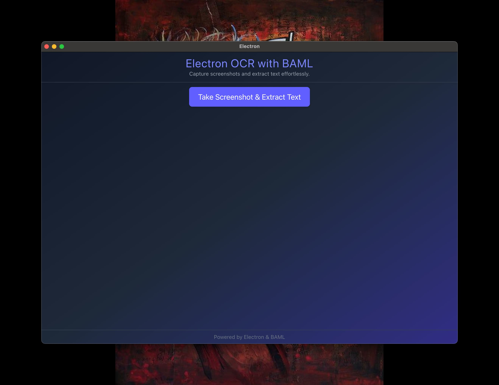
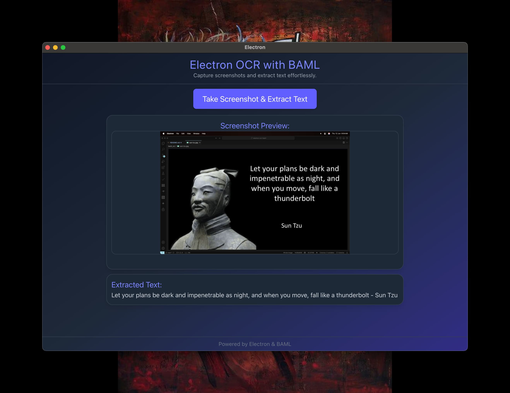

# Electron OCR with BAML

**Electron OCR with BAML** is a groundbreaking desktop app for Optical Character Recognition (OCR), built with Electron and BAML. It offers offline text extraction from images containing quotes with authors.





## Overview

This cross-platform Electron app enables offline OCR, extracting text from images containing quotes.

BAML integration makes prompt engineering simple with local testing.

## Technology Stack

- **[Electron](https://www.electronjs.org/)**: Cross-platform desktop app framework.
- **[Vite](https://vite.dev/)**: Fast build tool and dev server.
- **[TypeScript](https://www.typescriptlang.org/)**: Typed JavaScript for robust code.
- **[React](https://react.dev/)**: Dynamic UI library.
- **[BAML](https://www.boundaryml.com/)**: Customizable OCR workflow language.

## Installation

Use [Bun](https://bun.sh) for package management to set up the project:

```bash
# Install dependencies
$ bun install

# Run in development mode
$ bun run dev

# Build for distribution
# Windows
$ bun run build:win
# macOS
$ bun run build:mac
# Linux
$ bun run build:linux
```

## Resources

Explore the tech behind the project:

- [Electron Docs](https://www.electronjs.org/docs)
- [Vite Guide](https://vite.dev/guide/)
- [TypeScript Handbook](https://www.typescriptlang.org/docs/handbook/intro.html)
- [React Docs](https://react.dev)
- [BAML Overview](https://docs.boundaryml.com/)
